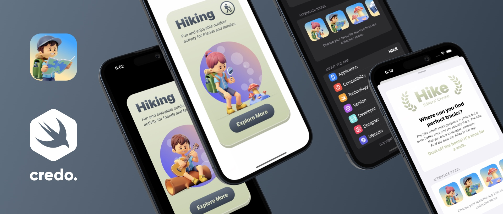

# This Hike App

### This project was created from the Credo.Academy course
###  used:
* Swift 
* SwiftUI
### learned:

* Card Component
* Header Component
* Custom Button Style
* Motion Animation
* Settings Sheet
* Resusable Component
* Alernate App Icons

